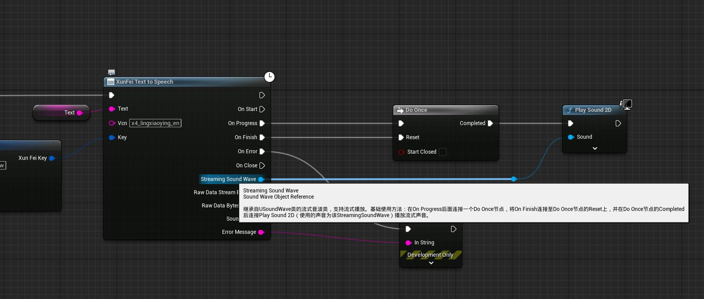
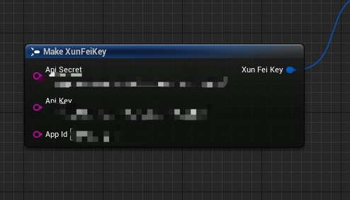

# XunFeiTTS
 XunFei text-to-speech intergration for unreal engine 5.

 虚幻引擎插件，支持讯飞在线语音合成

## 联系信息
 - 作者: Circle_
 - 网址: https://www.peihongzhe.com/
 - B站: https://b23.tv/EzPeUhU
 - 微信: sylbb520520

## 支持版本
 - 5.0 - 5.2

## 前置准备
 - 放入项目插件目录  {ProjectDir}/Plugins/
 - 需自行编译
 - 请勿与 Runtime Audio Importer 插件一同使用 https://www.unrealengine.com/marketplace/zh-CN/product/runtime-audio-importer

## 蓝图节点

 节点：
 XunFei Text to Speech
 - 此节点继承自UBlueprintAsyncActionBase类

| 输入 | 说明 |
| :- | -: |
| Text | 要合成语音的文本，合成时间受文本长度影响，文本越长耗时越久 |
| Vcn | 账号里可用的发音人，请前往讯飞控制台查询 https://passport.xfyun.cn/login |
| Key | 账号通行信息，请前往讯飞控制台查询 https://passport.xfyun.cn/login |

输出 | 说明 |
| :- | -: |
| Streaming Sound Wave | 继承自USoundWave的流式音波类，支持流式播放 |
| Raw Data Stream Base64 | 流式的Base64编码的音频字符串，内容为本次传输的部分 |
| Sound Wave  | 完成合成时的USoundWave资产，其余时候为空指针 |
| Error Message  |  发生错误时的错误信息 |

| 委托输出 | 说明 |
| :- | -: |
| On Start | 已连接上讯飞，开始合成，此时还未收到任何数据 |
| On Progress | 合成进行中，此时可以收到数据 |
| On Finish | 完成合成 |
| On Error | 连接发生错误 |
| On Close | 连接关闭 |

 节点连线参考
  - 基础使用方法：在On Progress后面连接一个Do Once节点，将On Finish连接至Do Once节点的Reset上，并在Do Once节点的Completed后连接Play Sound 2D（使用的声音为该StreamingSoundWave）播放流式声音。

- 讯飞账号的通行信息，包含Api Key, Api Secret, App Id 

- 通行信息获取地址： https://passport.xfyun.cn/login

 

 ## 参考

 讯飞语音合成（流式版）WebAPI 文档 https://www.xfyun.cn/doc/tts/online_tts/API.html
